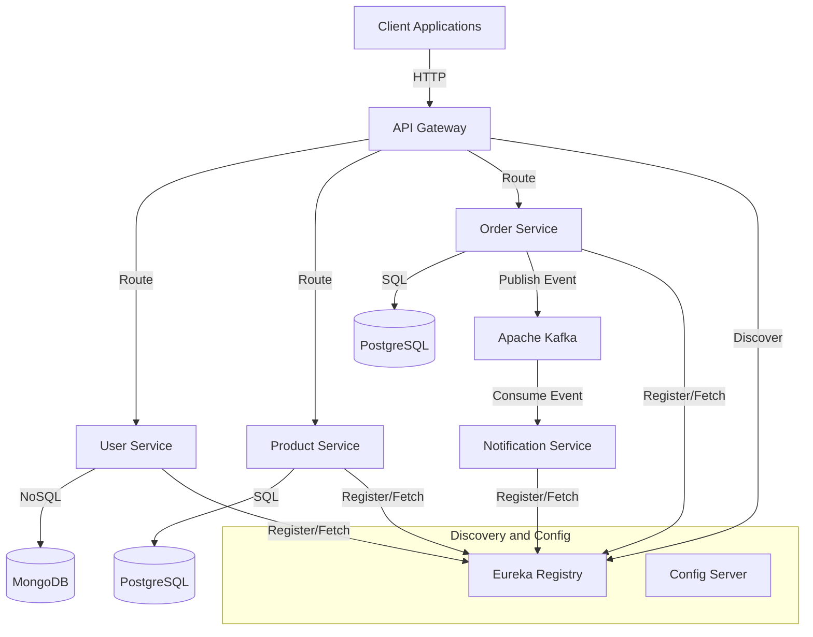

# 🚀 eCommerce Microservices

A robust, highly scalable eCommerce backend built using **Spring Boot Microservices**. This project demonstrates an enterprise-level architecture incorporating service discovery, centralized configuration, distributed tracing, event-driven communication, and comprehensive observability.

---

## 🌟 Overview

This project represents a complete decoupling of traditional monolithic e-commerce features into highly specialized, independently deployable microservices. By utilizing industry-standard patterns such as API Gateways, centralized configuration, and event-driven data flows, the system ensures high availability, scalability, and fault tolerance. It is designed to handle large volumes of traffic, processing user registrations, product searches, and asynchronous order fulfillment seamlessly.

---

## 🏗️ Architecture

The backend is split into multiple independent microservices. They communicate synchronously via an API Gateway and asynchronously through **Apache Kafka** for high-throughput event streaming.

### Core Microservices
1. **Config Server (`configserver` - Port 8888)**: Centralized configuration management using Spring Cloud Config. Services fetch their properties from here on startup.
2. **Service Registry (`eureka` - Port 8761)**: Netflix Eureka server for dynamic service discovery and registration.
3. **API Gateway (`gateway` - Port 8080)**: Spring Cloud Gateway acting as the single entry point for all client requests, securely routing them to the appropriate underlying services.
4. **User Service**: Manages user registration, profiles, and addresses. Stores user data securely in **MongoDB**.
5. **Product Service**: Handles the product catalog, CRUD operations, inventory management, and search functionality. Backed by **PostgreSQL**.
6. **Order Service**: Manages the shopping cart state and orchestrates order placement workflows. Backed by **PostgreSQL**.
7. **Notification Service**: Listens for asynchronous events (via Kafka) and processes notifications (e.g., dispatching order confirmation emails).

### Architecture Diagram

*(You can also place a static image of your architecture here. For example: ``)*



---

## 🛠️ Technology Stack

### Backend Frameworks
- **Java & Spring Boot** (Spring Web, Spring Data JPA, Spring Data MongoDB)
- **Spring Cloud** (Cloud Config, Netflix Eureka, Cloud Gateway)

### Infrastructure & Databases
- **PostgreSQL**: Relational database for robust, transactional data (Products and Orders).
- **MongoDB**: NoSQL document database for flexible user profiles.
- **Keycloak**: Identity and Access Management (IAM) for secure, token-based authentication and authorization.
- **Apache Kafka**: Primary message broker for high-throughput, asynchronous event-driven communication between microservices (e.g., decoupling Order creation from Notification processing).
- **Zookeeper**: Used to manage the Kafka cluster.

### Observability, Logging & Tracing
- **Zipkin**: Distributed tracing to track requests as they propagate across multiple microservices.
- **Prometheus**: Time-series database for robust metrics aggregation.
- **Grafana & Loki**: Centralized logging, metrics visualization, and monitoring dashboards.
- **MinIO**: High-performance object storage utilized within the observability stack.

---

## 🚀 Running the Application Locally

The easiest way to spin up the complex underlying infrastructure is using **Docker Compose**. All databases, message brokers, and observability tools are pre-configured.

### Prerequisites
- Docker & Docker Compose
- Java 17+ (If running Spring Boot services outside of Docker containers)
- Maven

### 1. Start Infrastructure Services
Navigate to the deployment directory and start the core infrastructure (PostgreSQL, MongoDB, Keycloak, Kafka, etc.):
```bash
cd deploy/docker
docker-compose up -d postgres mongo keycloak zookeeper kafka zipkin
```
*(Note: You can start the entire stack, including Prometheus and Grafana Loki, by simply running `docker-compose up -d` without specifying container names).*

### 2. Start Spring Boot Microservices
For local development, it is recommended to start the services via your IDE or Maven terminal in the following strict order to ensure proper initialization:
1. **Config Server** (`configserver`) — *Wait for it to fully start.*
2. **Eureka Server** (`eureka`) — *Wait for it to fully start.*
3. **Microservices** (`user`, `product`, `order`, `notification`)
4. **API Gateway** (`gateway`)

---

## 🔌 API Endpoints (Postman)

A complete Postman collection is included in the project root: `Spring Boot Microservices Professional eCommerce Masterclass.postman_collection.json`. 

Import this JSON file into Postman to interact with the APIs. All external client requests should be routed through the API Gateway (`http://localhost:8080`).

### Key Gateway Routes:
- **Users**: 
  - `POST /api/users` (Create)
  - `GET /api/users/{id}` (Retrieve)
- **Products**: 
  - `GET /api/products` (List all)
  - `POST /api/products` (Create)
  - `GET /api/products/search?keyword=...` (Search)
- **Cart/Orders**: *(Routed to Order Service)*
  - `POST /api/cart` (Add to cart)
  - `POST /api/orders` (Place order)
- **Config**:
  - `POST /encrypt` & `/decrypt` (Secure properties)

---

## 📬 Contact
Created by **Vrushabh Savani**
- **GitHub**: [vrushabh-savani](https://github.com/vrushabh-savani)
- **Email**: [vrushabhsavani123@gmail.com](mailto:vrushabhsavani123@gmail.com)
- **Portfolio**: [https://vrushabhsavani.netlify.app/](https://vrushabhsavani.netlify.app/)

Feel free to reach out if you have any questions or want to collaborate!
